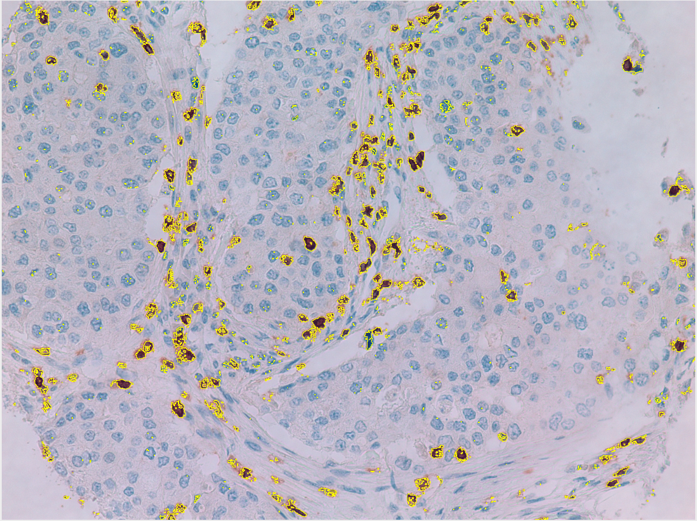

My lab was doing an analysis of breast cancer patients looking for correlations between
cytotoxic T cells and overall survival. Part of this invoved investigation of IHC tumor punches.
Their panel of antigens included ARG1, CD3, etc.

The problem was that they had to inspect and judge the stain coverage of the images by eye. This lead to a
human-rating system, 1-5, to indicate "how stained" a slide was. Suprisingly, this is a common
methodology [[1](http://onlinelibrary.wiley.com/doi/10.1111/j.1365-2559.2006.02513.x/full)].


I found some existing programmatic solutions to the problem [[2](http://journals.plos.org/plosone/article?id=10.1371/journal.pone.0096801)-
[3](https://www.nature.com/articles/srep32127)] but they were either not high-throughput, proprietary, or plugins
for ImageJ (heavy). Given that I wanted to find "how-stained" each IHC slide was for >300 images, nothing looked cheap and
high-throughput.


### Solution
My naive solution was brightness thresholding using the python cv2 module. Strained regions should be darker than their unstained counterparts.

To find the brightness cutoff to use for a "stained" region, I uploaded a few sample images to ImageJ and played with the built-in thresholding
tools [[4](https://www.unige.ch/medecine/bioimaging/files/1914/1208/6000/Quantification.pdf)]. HSV format was particularly suited for this type
of thresholding since [saturation is built into the image format.](https://en.wikipedia.org/wiki/HSL_and_HSV#Saturation)

#####  With a saturation cut-off of 147

This was a good start, but the other factor to take into account was that not 100% of the slides were covered by tissue. Fortunately, since even
the thin layers along the edges are slightly darker than the areas without any tissue in the slides, I was also able to threshold on
tissue as well.

#####  Saturation cut-off of 209 (including darker pixels to get total area of tissue)

With these two counts in hand (the number of pixels that are "stained" versus the number that fall under the class of "tissue"), it was possible
to create a ratio for each slide.


### Code
First, I need to quantify the number of stained pixels in the saturation matrix of the HSV image.
```python
import numpy as np

CELL_CUTOFF = 209
STAIN_CUTOFF = 147

def count(img, cutoff):
	img = img[:,:,2]
	sumd = len(img[img<cutoff])
	return sumd
```

[Array indexing with numpy](https://docs.scipy.org/doc/numpy-1.13.0/reference/arrays.indexing.html)
is a relatively fast approach. I then need to find the number of pixels above the two thresholds (one for tissue and one for stain).
```python
import cv2

img = cv2.imread(d + "/" + im)
img = cv2.cvtColor(img, cv2.COLOR_BGR2HSV)

st = count(img, STAIN_CUTOFF)
ce = count(img, CELL_CUTOFF)
per = st / ce
```

[cv2](http://opencv-python-tutroals.readthedocs.io/en/latest/index.html) has a built-in definition for converting an image to the
HSV format that's convenient for the cut-offs.

```python
from __future__ import division
import os, sys
import cv2
import numpy as np

print "IHC start"

CELL_CUTOFF = 209
STAIN_CUTOFF = 147

def count(img, cutoff):
	img = img[:,:,2]
	sumd = len(img[img<cutoff])
	return sumd

# loops thru each dir
fd = open("stainRatio.dat", 'w')
results = ""
ind = 0
di = os.walk('.').next()[1]

s = [st.split(" ")[1] for st in di]
for d in [y for (x, y) in sorted(zip(s,di))]:

	results += "\\n" + d + "\\n"
	# sort on slide number
	files = os.walk("./" + d).next()[2]
	end = [e.split(" ")[0] for e in files]

	# loops thru each file
	for im in [f for (e,f) in sorted(zip(end,files))]:
		img = cv2.imread(d + "/" + im)
		img = cv2.cvtColor(img, cv2.COLOR_BGR2HSV)

		st = count(img, STAIN_CUTOFF)
		ce = count(img, CELL_CUTOFF)
		per = st / ce

		results += im + "  " + str(per) + "\\n"

	ind += 1
	print("done with " + str(ind) + " of " + str(len(di)))

fd.write(results)
fd.close()
```

The full script (as configured above) will walk through a directory of patient records, quantify the IHC stain % of each image, and
save it in a dat file (though lots of this is specific to the directory format being sent, for example: each patient directory
is something like "Patient 1", so I split+sort on folder name).


### Caveats
This script would be better if the thresholds were not hard-coded. A slightly brighter overall IHC slide might mis-classify tissue
as empty fixative. A better solution would be to present the user with a sample image and asked them to pick a representative stained
area and an unstained area, then find the average saturation in a blotch around both points (using that to calibrate the threshold for a given 
image set)

An even less naive approach would be to find a ratio of stained cells, rather than to use surface area as a proxy. The shape of a cell
could be learned and the outlines could be drawn around each cell, after which saturation within the boundaries could be used to determine
whether it is or is not stained.


### Citations
* Taylor, C. R., and R. M. Levenson. "Quantification of immunohistochemistry—issues concerning methods, utility and semiquantitative assessment II." Histopathology 49.4 (2006): 411-424.
APA
* Varghese, Frency, et al. "IHC Profiler: an open source plugin for the quantitative evaluation and automated scoring of immunohistochemistry images of human tissue samples." PloS one 9.5 (2014): e96801.
* Shi, Peng, et al. "Automated ki-67 quantification of immunohistochemical staining image of human nasopharyngeal carcinoma xenografts." Scientific reports 6 (2016).
