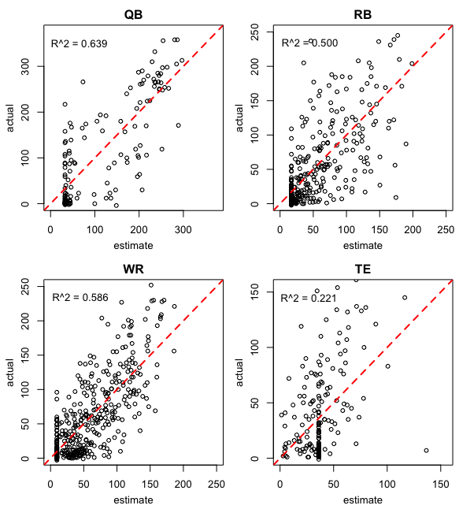
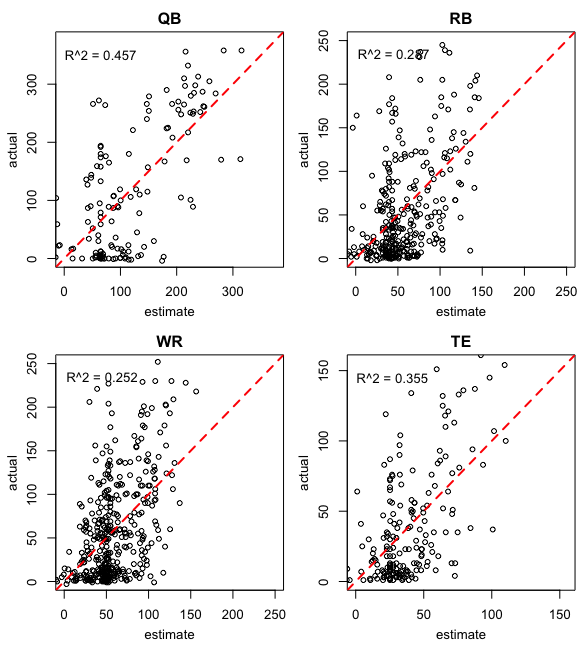
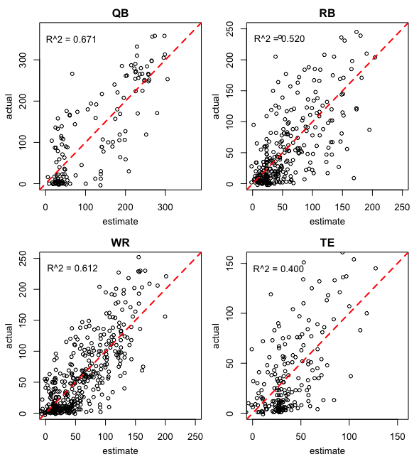

This week, on "Diminishing Returns for Models I Could Find Elsewhere"... I update my FF models with information from experts and [Madden](https://en.wikipedia.org/wiki/Madden_NFL).

In my other post, I showed the expected/actual plots for FF models based on basic player statistics alone. The takeaways were that 1) the best predictors of next year's fantasy points was last year's fantasy points -- and, rarely, age -- and 2) they sucked. The R^2's for RB, WR and TE were 0.23, 0.3, and 0.29, respectively.

Based on information I got from [Fantasy Football Analytics](https://fantasyfootballanalytics.net/), I knew that adding more information would improve the models. FFA (whose models I usually use) creates predictions by aggregating all the available rankings -- that are point based -- because the "wisdom of the crowd" tends to improve the models' abilities to explain variance in fantasy point outcomes. FFA claims their R^2's for QB, RB, WR, and TE were 0.73, 0.48, 0.57, and 0.55, respectively. It's unclear to me whether FFA is filtering to only include players that the experts ranked (ruling out players that didn't show up on the expert rankings), but, regardless, FFA's models look like they outperform [any expert ranking by itself](http://fantasyfootballanalytics.net/2017/03/best-fantasy-football-projections-2017.html).

## Using Averaged Expert Forecasts

So, to add additional information, I got historical expert rankings data from [a repository](https://github.com/isaactpetersen/FantasyFootballAnalyticsR/tree/master/Data/Historical%20Projections) maintained by the maker of the aforementioned FFA website ([Issac Petersen](https://psychology.uiowa.edu/people/isaac-petersen), an Assistant Professor in Psychology). Only projections from 2012 to 2014 were available, so on that year range.

I also averaged the yearly expert ranking for each year. This approach was a bit suspect, since there was more information for 2014 than 2013 or 2012, but I was fine with it as a proof of concept.

Also, and this is a caveat that I'll bring up again later, I imputed a big-'ol zero for any player that had a NA for mean expert ratings. In other words, if ESPN, FOX, etc didn't include a player in their forecast, I made the assumption that "they," the experts, said that player would get a zero. That's not actually what the experts predicted, they just didn't rank the player -- they only have the space/time to rank the best players -- but I wanted to account for the breakout stars that they neglected, so I used zero.

```r
dir <- "/Users/jtimmons/Documents/GitHub/ff/data/historical"
setwd(dir)

# single example cbs list
# there were actually ~15 sources from ESPN, NFL, FOX, CBS, and Yahoo
sources <- list(
  list(
    source = "CBS",
    name = "name",
    pts = "pts_cbs",
    years = c(2012, 2013)
  )
)

year.names <- c()
for (src in sources) {
  for (year in src$years) {
    hist.data.path <- paste0(dir, "/", src$source, "-Projections-", year, ".RData")
    d <- load(hist.data.path)
    fr <- get(d)
    fr <- fr[!duplicated(fr[src$name]),]

    # create the column
    col.name <- paste0(tolower(src$source), ".", year)
    year.names <- c(year.names, col.name)
    player.data[, col.name] <- NA

    # get names and points out of the data frame
    source.data <- data.frame(name = fr[, src$name], year = rep(year, nrow(fr)))
    source.data[col.name] <- fr[, paste0("pts_", tolower(src$source))]

    # add the point values in player.data
    player.data <- merge(player.data, source.data, by = c("name", "year"), all.x = TRUE)
    player.data[col.name] <- player.data[, paste0(col.name, ".y")]
    player.data[paste0(col.name, ".x")] <- NULL
    player.data[paste0(col.name, ".y")] <- NULL
  }
}

# only 2012-2014
player.data <- player.data[player.data$year %in% c(2012, 2013, 2014),]
player.data$experts <- apply(player.data[, year.names], 1, function(x) mean(x, na.rm = TRUE))
```

For the actual regressions, I was able to just use `lm`, rather than `plm`, since lagged statistics was no longer a concern. This saved a lot of code since I could use the `predict` [function](https://stat.ethz.ch/R-manual/R-devel/library/stats/html/predict.lm.html) to make the plots. And the result was an obvious improvement over the stats-only approach:


_FF models regressed on mean expert rankings_

Note the vertical streaks ~120 for QBs and ~50 for the other three positions. It's there because of the imputed zero's. It's the coefficient for each model; it signals that the players in those positions weren't rated at all by the experts. I'm debating whether to include those players in the models (and it's where I think my models differ most from FFA's -- I don't think Issac does). It's clear from the RB plot that most the players without an expert rating got less than 50pts on the season and were, therefore, justifiably, not included in the experts' forecasts.

## Using Madden Ratings

Another idea I wanted to try was regressing FF points on [Madden skill ratings](https://fivethirtyeight.com/features/madden/). These skill rankings have taken on a life of their own and are approaching [FIFA skill rankings](https://www.youtube.com/watch?v=wxrlL3dy0rY) in term's of "real-world" importance. Compared to the historical expert predictions, this data is readily available at [maddenratings.weebly.com](https://maddenratings.weebly.com/madden-nfl-16.html). But choosing covariates for Madden was tougher than the stats-only and expert rating models, since Madden has dozens. Some are obviously singular to position, like Throw Power for quarterbacks, but others matter to most positions. (For a breakdown of how each stat matters for Madden's "Overall" stat, see here: [madden overall weightings](<https://cdn.vox-cdn.com/thumbor/-NGMJwp1oNXGZw7YJrmPtWr2rtc=/0x0:1079x763/920x0/filters:focal(0x0:1079x763):format(webp)/cdn.vox-cdn.com/uploads/chorus_asset/file/3442564/Screen_Shot_2015-02-24_at_1.11.50_PM.0.png>)).

I use the Madden stats from the end of the prior season. So Madden 2016 stats correspond to the 2015 season and are used to predict the players' fantasy points in the 2016 season.

I took the lazy-man's approach and used stepwise selection with the `stepAIC` function from the `MASS` package. I regret nothing. It saved me hours. Am I overfitting? Yeah, probably. For example, if I include all the Madden stats I get a model with kick_power being a predictor of RB points... How does Madden even assign a Kick Power attribute to a running back? So I tried to only include logical covariates in the model before handing it to the god-like `stepAIC`. I'll worry about variance and cross-validate later (maybe next year).

```r
## RB
rb.formula <- formula(fantpt ~ overall + injury + stamina + toughness + catching + acceleration + carrying + trucking + stamina + agility + elusiveness + speed + awareness + strength + age.x + years_pro)
rb.model <- lm(rb.formula, data = rb.data)
rb.fit <- stepAIC(rb.model, direction = "both")

summary(rb.fit)

    Coefficients:
                Estimate Std. Error t value Pr(>|t|)
    (Intercept)   124.4561    37.1560   3.350 0.000909 ***
    overall         1.8693     0.5594   3.342 0.000934 ***
    injury         -1.1549     0.4585  -2.519 0.012262 *
    route_running   1.2761     0.4147   3.077 0.002274 **
    return         -0.3802     0.2567  -1.481 0.139561
    toughness      -1.6495     0.4683  -3.522 0.000492 ***
    catching       -1.7213     0.5666  -3.038 0.002584 **
    acceleration    0.2531     0.1716   1.475 0.141098
    carrying        1.2320     0.5782   2.131 0.033905 *
    trucking        0.4699     0.3083   1.524 0.128521
    elusiveness     0.6351     0.2905   2.187 0.029508 *
    age.x          -3.6927     1.5570  -2.372 0.018316 *
```

And the results from Madden-only models:


_FF models regressed on Madden stats. Inferior to the Experts_

## Using Both

And, of course, I've combined the two data sources. In keeping with what I learned from FFA, the R^2's improved greatly compared to either data source by itself. I really need to correct for overfitting/variance, but, in the short-term, I'm optimizing against the percentage of explained variance.


_FF models regressed on Expert forecasts + Madden stats. Better than any other_

As a recap of the R^2's from the three approaches:

```
Model      Experts     Madden     Experts+Madden
QB         0.639       0.457      0.671
RB         0.500       0.287      0.520
WR         0.586       0.252      0.612
TE         0.221       0.355      0.400
```

The interesting part of this is that Madden appears to do better than the Experts with TE's. I can think of two reasons off-hand. The first is the "imputed-zero-problem." If I only score experts for the TE's that they bothered ranking, their R^2 will look a lot better. Secondly, fantasy football analysts generally spend a lot less time on TEs in general. They don't get a lot of points (see plots) and rarely make much of a difference. Unless you're talking about Rob Gronkowski or Jimmy Graham -- someone on a pass-heavy team that gets looks on the goal-line -- the TE won't be a game winner. Because they're often neglected, my guess is that Madden will also do a better job with Kickers and DSTs.

## Future

Since I want to have this done by draft-time, I might move onto building Value-Over-Replacement rankings for 2018 (using Madden + Expert info). And I need to make the app. But there's obvious room for improvement here with these models.

Some ideas:

1. Weight expert rankings by their historical R^2 (hard to get data and has already been done by FFA and [https://www.fantasyfootballnerd.com/](https://www.fantasyfootballnerd.com/))
2. Get more years' data and cross-validate (boring)
3. Go non-linear (feels premature before cross-validating)
4. Tree-based models (funnest)

I'm also second-guessing the usefulness of including every player in the regression. It's not like every player gets drafted. For example, in a 12 team league, maybe 24 QBs will be drafted (unlikely). So why bother fitting the model against the QBs at the bottom of the stack? So I may experiment with filtering on expert ratings and the Madden Overall stat to see how that does for player fantasy points.

And, speaking of fantasy points, I may change up the response variable that I'm regressing for. Right now the response variable is fantasy points, but, when I make the draft app, it's going to sort players by their Value-Over-Replacement (VOR). It's the best way to compare a QB and a RB when choosing who to draft in a given round. After I get the ranking-generating script working, I may compare fantasy points versus VOR to see how using VOR generates affects the models.
